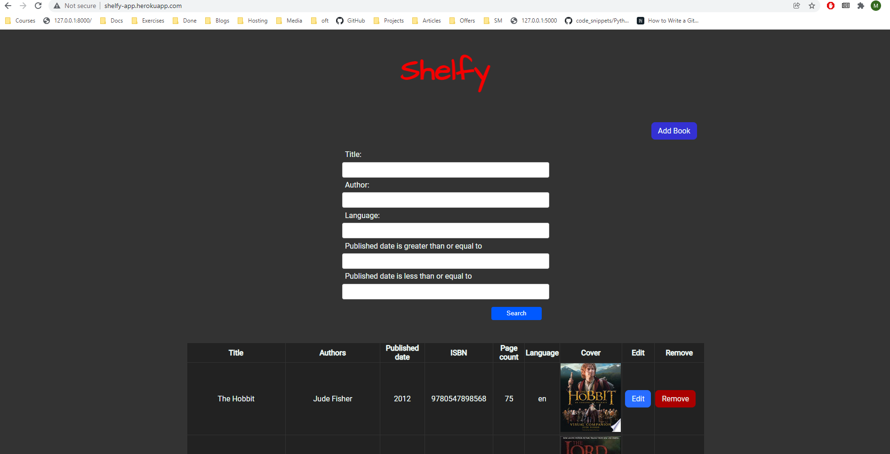
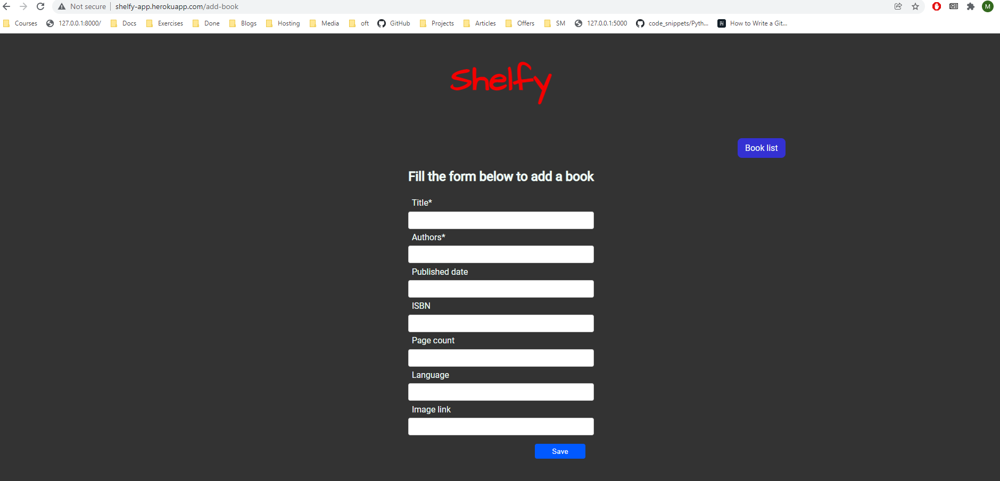
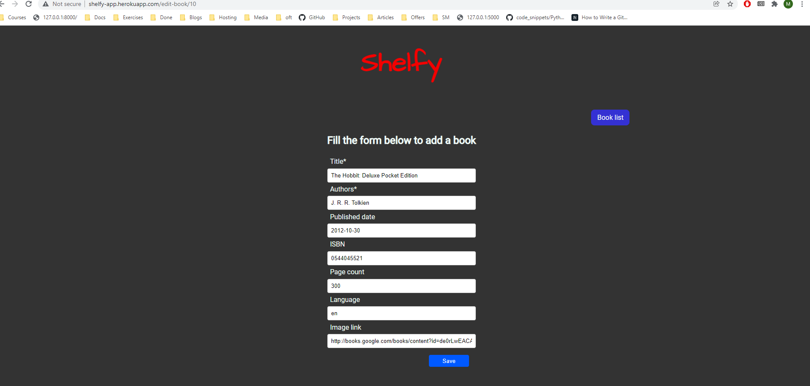
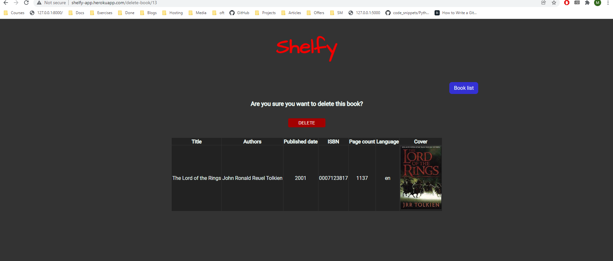
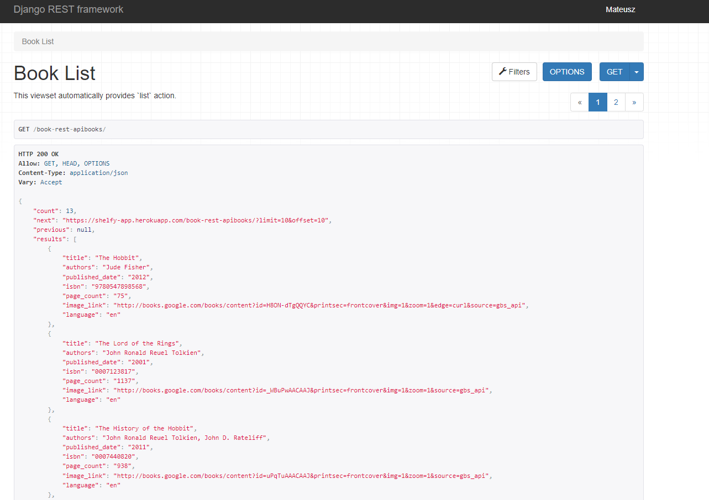

# Shelfy

## Table of contents
* [General info](#general-info)
* [Technologies](#technologies)
* [Features](#features)
* [Setup](#setup)

## General info

App created for STX next recrutiment process

## Technologies
 - Python
 - Django
 - Django Rest Framework
 - Postgreql
 - Unittest
 - Heroku

## Features

 - Create, Read, Update, Soft Delete Books
 - Searching in main book list
 - Importing books from Google Books API
 - REST API List viewset: https://shelfy-app.herokuapp.com/book-rest-api with search and filter functionalities
 - Unit tests

 ## Setup 

Clone repo `git clone https://github.com/MateuszM-M/shelfy-stx-recruitment-task`,

Go to repo directory `cd shelfy`,

Create virtual environment `python -m venv venv`,

Activate environment `venv\scripts\activate`,

Install required packages `pip install -r requirements.txt`,

Rename shelfy/settings/`.env-example` to `.env`,

Migrate database `python manage.py migrate`,

Make server up and running `python manage.py runserver`,

Browse http://127.0.0.1:8000/

Or

Online demo: https://shelfy-app.herokuapp.com/

API: https://shelfy-app.herokuapp.com/book-rest-api